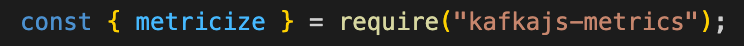
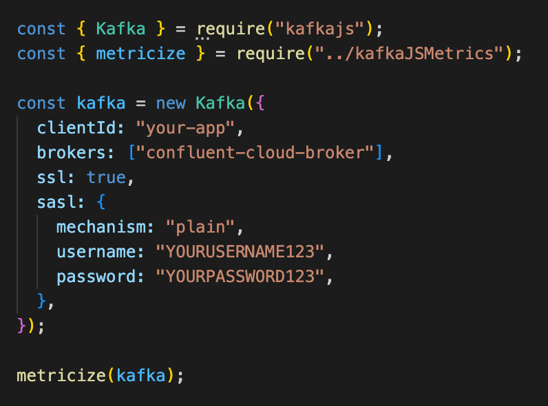
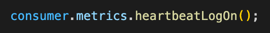
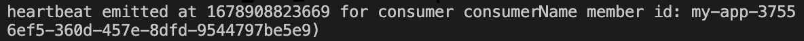
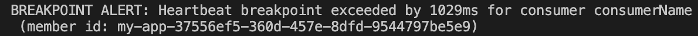

<p align="center"></p>

# **KafkaJSMetrics**

A lightweight KafkaJS library that provides simple access to key metrics within your code. KafkaJSMetrics enables custom breakpoint alerts and logging of key metrics, allowing for client health to be monitored within applications. The optional visualizer feature introduces a real-time, web browser display of the metrics associated with your KafkaJS client.

## Table of Contents

- [Introduction](#introduction)
- [Features](#features)
- [Getting Started](#getting-started)
  - [Installation](#installation)
  - [Usage](#usage)
  - [Visualization](#visualization)
- [Contributing](#contributing)
- [Contributers](#contributors)
- [Other](#other)

# **Introduction**

Apache Kafka is a distributed event streaming platform that is designed to handle high performance data pipelines in real-time. KafkaJS is a lightweight and user friendly Apache Kafka client library that runs on Node.js, providing a simple and reliable way to produce and consume messages from Kafka clusters. Event emitters called Instrumentation Events are built into KafkaJS that provide information about the performance and behavior of a user's Kafka producers and consumers. These events are designed to help developers monitor and troubleshoot thier Kafka applications, but incorporating instrumentation events into code can be tedious and boilerplate heavy.

KafkaJSMetrics is a continuously-growing open source product that is designed to simplify and shorten the metric exposing processes. By being 100% javascript and working alongside KafkaJS, the library leverages the already built-in instrumentation events without relying on other third-party applications or requiring any additional installations. The library gives developers simple access to key metrics required to monitor the health of a Kafka instance.

## **Features**

Below are highlighted key features from KafkaJSMetrics. For full explanation of library functionality, visit our [docs](https://www.kafkajsmetrics.com/docs/index.html)

**Key features include**

- Access to key consumer/producer/admin metrics, including
  - offset lag
  - messages consumed
  - total number of consumer/producer/admins currently connected
  - heartbeat
  - partition assignment
  - see [docs](https://www.kafkajsmetrics.com/docs/index.html) for complete metrics
- Custom Breakpoint Alerts and On/Off metrics logging options, including
  - heartbeat monitor
  - request queue size monitor
  - request pending duration monitor
  - offset lag monitor
  - see [docs](https://www.kafkajsmetrics.com/docs/index.html) for complete Breakpoint Alert and metrics logging options
- Web-browser visualizer that displays consumer metrics in real-time
  - Secure token access and developer-friendly interface

---

# **Getting Started**

KafkaJSMetrics works with your KafkaJS client. For information on setting up your KafkaJS client, visit [KafkaJS](kafka.js.org).

- [Installation](#installation) and [Usage](#usage) walk through setting up the KafkaJSMetrics library for use within your KafkaJS Client code

- [Visualization](#visualization) takes you through the optional feature set-up for web browser visual display of your KafkaJS Client metrics

## **Installation**

---

Install the kafkajs-metrics-visualizer package from [npm](https://www.npmjs.com/)

```bash
npm install kafkajs-metrics-visualizer
```

---

## **Usage**

KafkaJSMetrics works with your existing KafkaJS client. More information about KafkaJS at [kafka.js.org](kafka.js.org).

1. Require kafkaJSMetrics in your KafkaJS Client file to access metricize
<p align="left"></p>

2. Pass your KafkaJS Client instance into the metricize function (sample KafkaJS Client provided)

   - All consumer, producer, and admin instances created from this client will now have metrics and metrics-associated functionality

<p align="left"></p>

All consumer, producer, and admin instances created from this client will now have metrics and metrics-associated functionality

3. Run your KafkaJS Client file

```bash
node client.js
```

### **Turn on logging methods**

Visit the [docs](https://www.kafkajsmetrics.com/docs/index.html) for a full list of available logging methods

Example:

<p align="left"></p>

Prints to console:

<p align="left"></p>

### **Turn on breakpoint alerts**

Example:

<p align="left"></p>

Prints to console:

<p align="left"></p>

---

## **Visualization**

The following steps will allow you to access the web browser visualizer to display metrics. This is visualizer is an optional feature and will not affect the library performance.

1. Open the [KafkaJSMetrics webpage](https://www.kafkajsmetrics.com). Click on the [visualizer tab](https://www.kafkajsmetrics.com/#/visualizer) and generate a new token

\*\*\*insert gif here - start at home page, click on visualizer tab, click generate and then copy

2. Copy the token and head back to to your KafkaJS client file. Inside the metricize function, add two additional arguments:

   - first argument is the boolean value true
   - second argument is your copied token

<p align="left"></p>
 
 3. Back in the browser, click authenticate to access your web browser metrics display
 
 ***insert gif here - clicking authenticate and being taken to the chart page, plus a few seconds on chart page to show charts updating dynamically

---

# **Contributing**

As growing developers, we welcome and encourage feedback! We are also always trying to improve our code so we actively welcome all contributions! If you would like to be a part of this product please follow the steps below.

1. Fork this repo of KafkaJSMetrics and then clone it to your machine
2. Make sure to check out into the branch that you want to make contributions in

   1. Contributions to the website as well as the visualizer:

      ```bash
      git checkout visualizer
      ```

   2. Contributions to the library:

      ```bash
      git checkout dev
      ```

3. Create a feature branch

```bash
git checkout -b [feature/AmazingFeature]
```

4. Add all your changes with the add command

```bash
git add [all your changes]
```

5. Commit all your changes

```bash
git commit -m '<your comment>'
```

6. Make sure the visualizer OR dev branch is up to date

   1. Check back out to the visualizer OR dev branch

   ```bash
   git checkout visualizer [OR] dev
   ```

   2. Pull down the latest version

   ```bash
   git pull origin visualizer [OR] dev
   ```

   3. Check back out to your feature branch

   ```bash
   git checkout [feature/AmazingFeature]
   ```

7. Merge your branch with visualizer OR dev

```bash
git merge visualizer [OR] dev
```

8. Resolve any merge conflicts
9. Run unit tests and make sure all tests pass

```bash
npm test
```

10. Push up your branch with the command

```bash
git push origin [feature/AmazingFeature]
```

11. Finally, open a pull request for us to review!

---

# **Contributors**

- Paul Davey - [GitHub](https://github.com/pauldavey1) | [LinkedIn](https://www.linkedin.com/in/paulcdavey/)
- Amanda Smith - [GitHub](https://github.com/amsmithf) | [LinkedIn](https://www.linkedin.com/in/amanda-margaret-smith/)
- Josh Tesoro - [GitHub](https://github.com/jshwatsoro) | [LinkedIn](https://www.linkedin.com/in/joshwa-tesoro/)
- Rebecca Anderson - [GitHub](https://github.com/Randers9) | [LinkedIn](https://www.linkedin.com/in/rebecca--anderson/)
- Ranan Hui - [GitHub](https://github.com/rananhui) | [LinkedIn](https://www.linkedin.com/in/rananhui/)

---

# **Other**

Important links:

- [Full Documentation](https://www.kafkajsmetrics.com/docs/index.html)
- [Website](https://www.kafkajsmetrics.com/#/visualizer) and [Visualizer](https://www.kafkajsmetrics.com)
- Check out our latest [Medium article](mediumArticle.com)

_KafkaJSMetrics and KafkaJSMetrics Visualizer are licensed under the Mozilla Public License version 2.0 and are available for free. We have no affiliation with and are not endorsed by either The Apache Software Foundation or the developers of KafkaJS._

---
